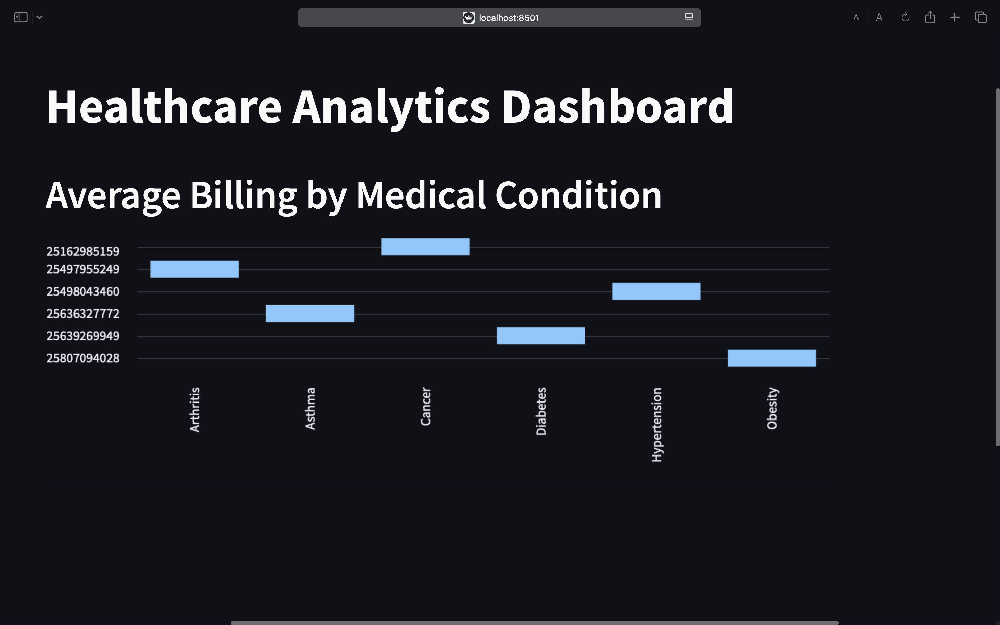

# Healthcare Analytics Dashboard

## Overview
The Healthcare Analytics Dashboard is a user-friendly platform designed to analyze and visualize key healthcare data such as patient demographics, billing information, medical conditions, and more. This dashboard is built using Python, Streamlit, and MySQL, providing interactive and insightful visualizations for healthcare administrators and stakeholders.

---
  
## Features
- **Patient Insights:** Visualize demographic distributions such as age, gender, and medical conditions.
- **Financial Analysis:** Analyze average billing amounts based on conditions, hospitals, and insurance providers.
- **Medical Trends:** Explore admission types, discharge timelines, and medication usage.

---  

## Project Structure
```plaintext
Healthcare-Analytics-Dashboard/
├── app/
│   ├── dashboard.py         # Main Streamlit app file
├── database/
│   ├── __init__.py          # Makes it a Python package
│   ├── connection.py        # Database connection logic
│   ├── load_data.py         # Functions to load data
│   ├── queries.py           # SQL query functions
├── data/
│   ├── raw/                 # Raw data files
│   ├── processed/           # Processed data files
├── screenshots/
│   ├── 1.jpeg               # Dashboard screenshot
├── requirements.txt         # Python dependencies
├── README.md                # Project documentation
```

---

## Getting Started

### Prerequisites
- Python 3.8 or higher
- MySQL Workbench
- Streamlit

### Installation
1. Clone the repository:
   ```bash
   git clone https://github.com/SHRISH01/Healthcare-Analytics-Dashboard.git
   ```
2. Navigate to the project directory:
   ```bash
   cd Healthcare-Analytics-Dashboard
   ```
3. Install dependencies:
   ```bash
   pip install -r requirements.txt
   ```

### Database Setup
1. Create a MySQL database.
2. Load the processed CSV files into MySQL tables.
3. Update `connection.py` with your MySQL credentials.

### Run the Dashboard
1. Start the Streamlit app:
   ```bash
   streamlit run app/dashboard.py
   ```
2. Open the app in your browser at `http://localhost:8501`.

---

## Screenshot


---
